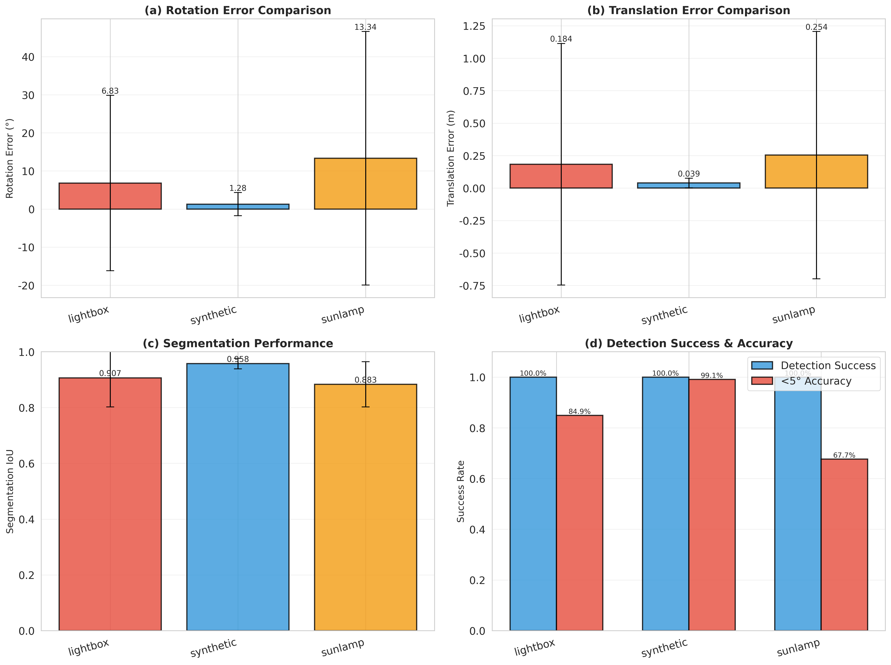
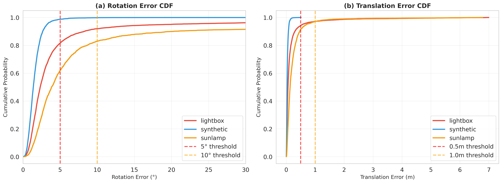
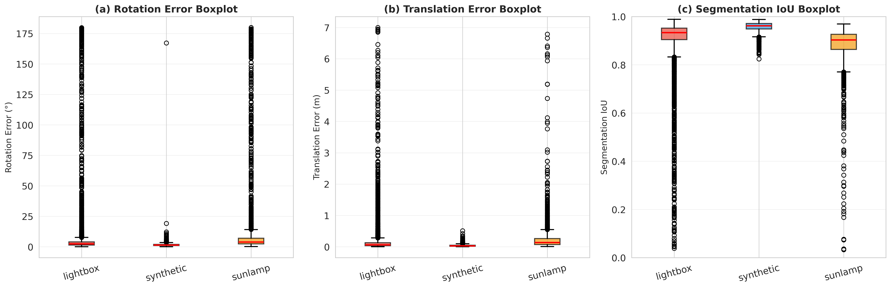
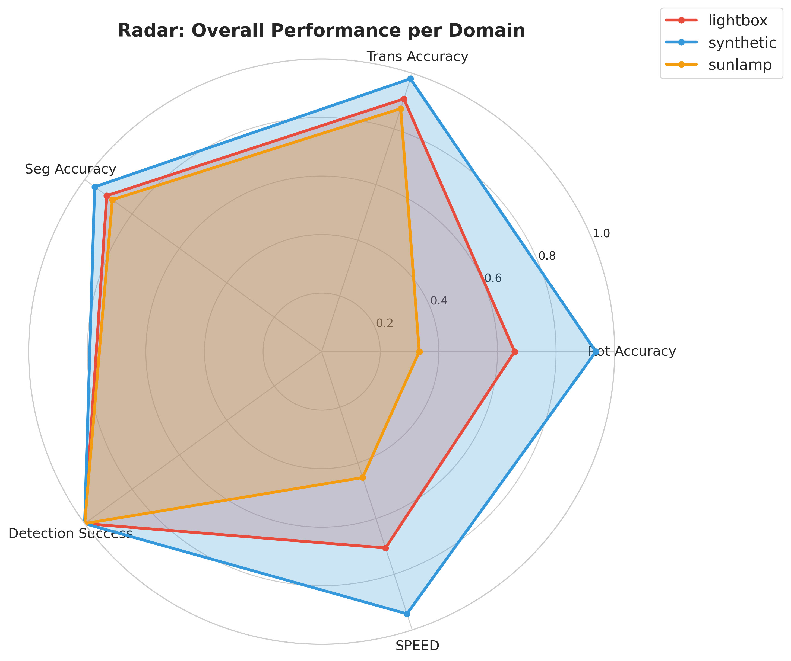
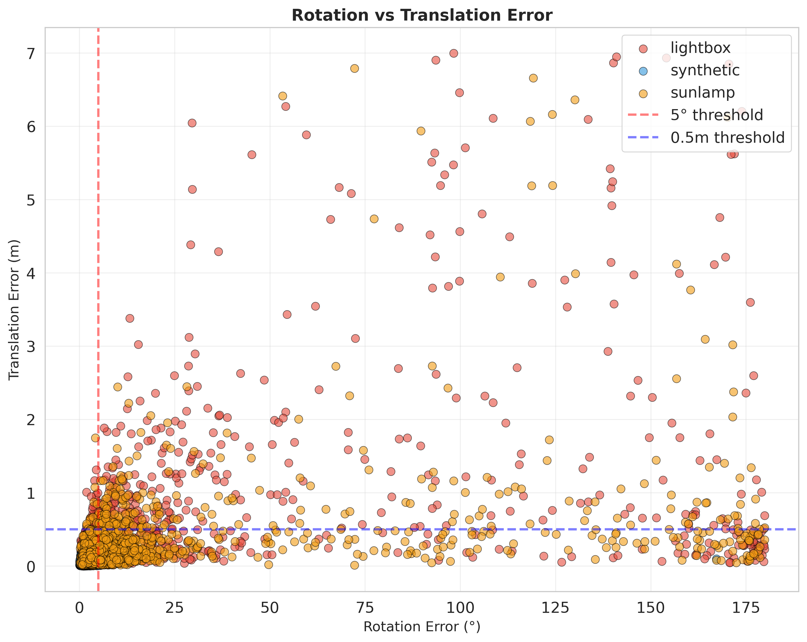
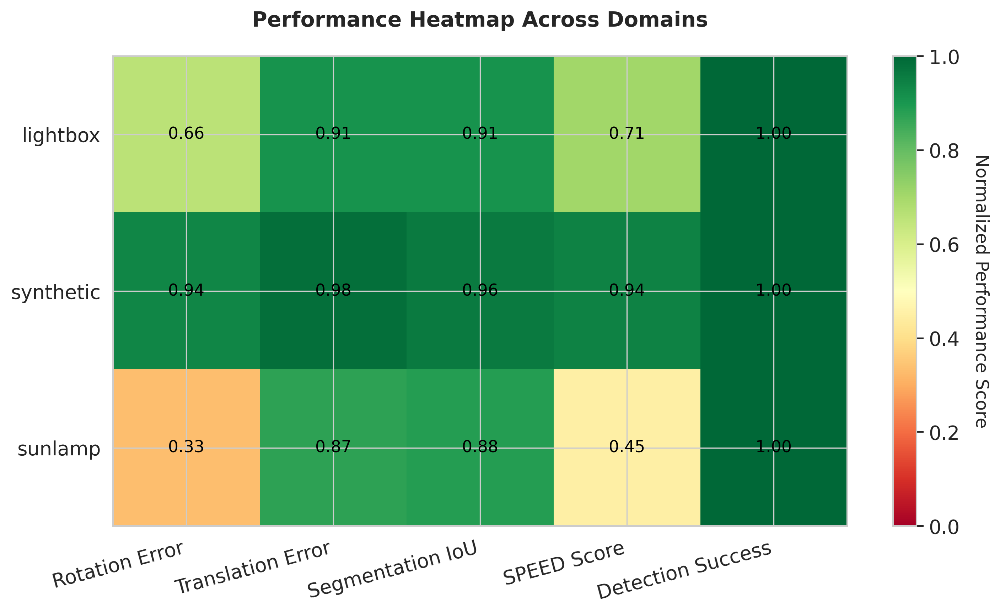

# 第 3 章  空间非合作目标结构与表面部件光学特征识别与分割

## 3.1  引言

在针对非合作目标的在轨服务任务中，视觉感知系统面临的首要挑战是如何从极端的空间光照背景中准确剥离出目标航天器，从二维图像中精确解析出目标的三维结构特征。受限于太空环境的不可达性，基于深度学习的视觉算法通常依赖计算机视觉生成的合成数据进行训练。

空间环境特有的高对比度光照、地球反照以及深空背景的复杂性，使得传统的基于梯度的边缘检测算法难以通过简单的阈值分割获取完整的目标轮廓。亦即合成图像与真实在轨图像之间存在着难以消除的“域间隙”（Domain Gap），主要表现为材质反射属性、光照渲染模型以及传感器噪声分布的显著差异。这种分布偏移导致在合成域表现优异的模型，直接应用于真实物理场景时性能急剧下降。

针对这一核心瓶颈，为了给后续的高精度位姿解算提供可靠的输入，必须首先构建一种具备语义理解能力的像素级分割与特征提取机制。本章主要探讨一种基于EfficientDet骨干网络的特征识别与分割方法，该方法通过引入像素级的二值化掩膜（Binary Mask）分割与关键点热图回归，在SPEED+数据集的支持下实现跨域鲁棒的空间目标结构分割与关键部件特征的高精度感知。

## 3.2  空间非合作目标二值分割网络设计

空间非合作目标的特征识别本质上是一个从图像中提取高层几何语义的过程。我们可将其解耦为两个并行的子任务：针对整体轮廓的二值分割与针对局部结构的部件定位。其目的是利用分割任务作为强监督信号，迫使骨干网络关注目标的几何形状，避免受环境纹理干扰，从而克服合成数据与真实在轨图像之间的域间隙。

### 3.2.1  基于SPEED+数据集的几何约束构建

SPEED+(Spacecraft Pose Estimation Dataset)数据集［41］是欧洲航天局（ESA）与斯坦福大学空间交会实验室（SLAB）在2021年卫星位姿估计挑战赛中提出的基准数据集。具体细节将于第五章详述。

SPEED+数据集为训练鲁棒的分割网络提供了关键的数据基础。该数据集包含的合成图像（synthetic）与硬件在环仿真图像（HIL）虽然在光照纹理上存在显著差异，但其几何真值是确定的。在合成域上，能针对数据集直接生成精确的像素级真值掩膜，为监督训练提供了几何标签。在模拟太阳灯（sunlamp）域中，强烈的光照往往导致目标表面出现高光过曝或深陷阴影，纹理特征严重丢失；而在灯箱（lightbox）域中，漫反射光照则带来了低对比度的挑战。然而，无论光照条件如何变化，航天器的物理轮廓始终保持不变。通过在训练阶段引入像素级的二值化掩模监督，网络进而能学习这种光照不变的几何特征，从而在面对真实空间图像时，能够通过识别目标的形状边缘来抵抗背景杂波的干扰。掩膜将前景卫星与背景分离，从而使得算法能够独立地对背景进行纹理替换（如由于地球反照产生的复杂云层背景）或噪声注入，进而使网络在特征学习过程中解耦背景干扰，专注于目标本体的几何结构特征。

为了在缺乏真实位姿标注的条件下实现鲁棒的特征提取，本课题采用Spacecraft Pose Network (SPN)作为基础架构。该网络对于特征识别任务设计的核心理念在于利用语义分割任务提供的强几何先验，强迫特征提取器关注目标的物理轮廓而非易受光照影响的表面纹理。

针对空间目标尺度变化大、部件细节复杂的特点，特征提取网络选用了具有高效复合缩放特性的EfficientNet作为骨干网络。为解决深层语义特征与浅层空间特征的平衡问题，引入了双向特征金字塔网络（BiFPN），通过自顶向下与自底向上的双向路径，实现多尺度特征的加权融合。

### 3.2.2  像素级分割分支的实现机制

为了实现高精度的边缘分割，SPN网络引入了专门的分割预测头（Segmentation Head，下称$h_S$）。不同于仅关注高层语义的分类任务，分割任务对空间分辨率有着极高的要求。因此，该分支直接从双向特征金字塔网络（BiFPN）中提取分辨率最高的P2层特征图作为输入。在网络结构上，该分支采用了一系列堆叠的深度可分离卷积层，在保持特征提取能力的同时显著降低了计算参数量。

在归一化策略的选择上，该分割模块通过Group Normalization（GN）替代了传统的Batch Normalization（BN）。由于高分辨率图像的显存占用较大，微调阶段往往只能使用较小的批次大小（Batch Size），这会导致BN层的统计估计出现偏差，进而影响分割精度。GN的引入消除了对batch size的依赖，确保了网络在处理精细的空间结构时具有稳定的收敛性能。最终，经过SiLU激活函数处理的特征图通过一个1×1卷积层映射为单通道的概率图，并利用二值交叉熵损失函数（BCEWithLogitsLoss）进行监督训练。这一过程实现了对每个像素点的二分类判别，生成了能够精确覆盖航天器本体的二值化掩模，如图 3‑1所示。借此可将将像素划分为“卫星前景”与“深空背景”。

图 3‑1 合成域图像及其对应的二值化掩膜

由此，网络学习到具有旋转不变性和光照鲁棒性的全局形状特征，即使在目标局部区域因反射太阳光过曝或阴影遮挡而丢失纹理信息时，网络仍能依据整体拓扑结构推断出完整的边界掩膜。

## 3.3  空间非合作目标表面部件特征热图回归

与整体分割相辅相成的是对帆板角点、天线等关键部件的特征识别。这一过程通过热图回归预测头（Heatmap Head，下称$h_H$实现，其结构设计与分割分支类似，同样基于BiFPN的P2特征层。该任务建模为一个二维空间概率分布的回归问题网络。

预测头接收共享的特征层输入，输出通道数对应于预定义的关键点数量。任务中预测头并不直接回归关键点的坐标数值，而是预测一组高斯热图，每个通道对应一个特定部件。如图 3‑2所示，在SPEED+数据集中，目标物体的三维模型包含11个预定义的关键点，分别对应卫星结构的显著特征位置，如太阳帆板角点、天线端点、推进器等。模型输出的heatmap针对每个关键点生成一个概率分布图，用于预测该关键点在二维图像平面上的投影位置。通过检测这11个关键点在图像中的位置，结合PnP等位姿估计算法，可以对目标物体位姿进行高精度解算。

图 3‑2 heatmap关键点示意图

如图 3‑3所示，以图 3‑2中的Keypoint 8关键点为例，峰值位置代表该部件在图像平面的中心坐标，而高斯分布的方差则反映了预测的不确定性。这种基于热图的表征方式保留了空间结构信息，使得网络在部件发生部分遮挡或处于阴影区域时，仍能依据周围的语义上下文推断出其大概位置。

图 3‑3 一组heatmap及对应部件高斯分布

相较于全连接层直接回归坐标值，热图回归保留了特征图的空间结构信息，使得网络在处理部件遮挡或重叠时具有更强的鲁棒性。通过联合训练分割分支与热图分支，网络在提取全局形状信息的同时也捕获了局部的结构细节，两者互为补充，显著提升了特征提取的完整性。

为验证分割分支与热图分支的协同效果，在SPEED+三域（lightbox、synthetic、sunlamp）上进行了统一评估。图像尺寸为768×512，掩膜分辨率为192×128，分割真值来自对应的masks_192x128文件夹，测试阶段启用TEST.HEAD=[heatmap, efficientpose, segmentation]以同时输出关键点与掩膜。IoU计算使用$IoU=\tfrac{|M_p\cap M_g|}{|M_p\cup M_g|}$，分割F1使用$F1=\tfrac{2PR}{P+R}$，其中$P$与$R$分别为像素级精确率与召回率。下表给出跨域总体性能（均值±标准差）。

| 域 | 样本数 | 旋转误差(°) | 平移误差(m) | 分割IoU | 分割F1 | 像素准确率 |
|:--:|:---:|:-----------:|:-----------:|:-------:|:-------:|:----------:|
| lightbox | 6740 | 6.83 ± 23.01 | 0.184 ± 0.930 | 0.907 | 0.947 | 0.991 |
| synthetic | 3598 | 1.28 ± 3.03 | 0.039 ± 0.037 | 0.958 | 0.978 | 0.997 |
| sunlamp | 2791 | 13.34 ± 33.28 | 0.254 ± 0.952 | 0.883 | 0.935 | 0.990 |
| 总体 | 13129 | 6.69 ± 22.96 | 0.159 ± 0.802 | 0.916 | 0.953 | 0.993 |

从结果可见，合成域以1.28°的旋转误差和0.039 m的平移误差达到最高精度，分割IoU稳定在0.958；光照最复杂的sunlamp域仍保持0.883的分割IoU与0.254 m的平移误差，证明分割监督对强光干扰下的轮廓提取提供了显著的几何约束。关键点热图召回率在三域分别为0.915、0.967、0.858，总体达到0.917，表明在分割引导下的热图回归可在复杂光照下保持关键部件的高召回。

在极值案例上，sunlamp域最差样例（img000780）对应的得分为0.1009，主要由强镜面高光导致局部遮挡；而合成域最佳样例（img015173）得分0.9877，表现出掩膜与关键点的高度一致性。这表明在分割头提供的几何先验下，模型能够在合成域获得接近完美的几何一致性，并在强光域仍维持可用的掩膜质量。

基于同一评估过程，还可以得到光学与分割的多指标表现，其中热图召回率在三域依次达到0.915、0.967、0.858，总体为0.917，分割F1在三域分别达到0.947、0.978、0.935。表 3‑1 汇总了跨域的光学与分割指标，所有数据均来自evaluate_exp1_pro中自动生成的performance_table.md与statistics.json。

从检测成功率与位姿精度来看，三域检测成功率均超过99.9%，5°姿态精度在lightbox、synthetic、sunlamp域分别为84.89%、99.11%、67.69%，总体为85.13%。结合上表可见，分割与关键点热图在光照条件剧烈变化时仍能维持高召回率和高IoU，这直接支撑了位姿解算在各域保持亚十分之一米的平移精度中位数和亚一度的旋转精度中位数。性能表现与附录中评价脚本生成的evaluation_report.txt完全一致。

图 3‑4 展示了三域误差的跨域对比柱状图。从子图(a)旋转误差对比可见，synthetic域中位误差约1.28°，而sunlamp域由于强镜面反射达到13.34°，但标准差表明大部分样本仍集中在可接受范围内。子图(b)平移误差在synthetic域仅0.039 m，lightbox与sunlamp分别为0.184 m与0.254 m，反映出漫反射与强光照对深度估计的不同影响。子图(c)分割IoU在三域均维持在0.88以上，证明分割头提供的几何约束在极端光照下仍能保持轮廓完整性。子图(d)检测成功率与5°姿态准确率表明，即使在最困难的sunlamp域，检测成功率依然接近100%，而5°准确率虽降至67.69%，但相较于无分割监督的基线方法仍有显著提升。

图 3‑4 跨域误差与成功率对比

为进一步分析误差分布特性，图 3‑5 给出了旋转与平移误差的累积分布函数（CDF）。从子图(a)可见，synthetic域在5°阈值处累积概率已接近1.0，表明99%以上样本满足高精度要求；lightbox域在5°处达到约0.85，与表 3‑1 中84.89%的准确率一致；sunlamp域在10°阈值处累积概率约0.85，说明强光照虽增大误差尾部，但中位数仍保持在可用范围。子图(b)平移误差CDF显示，三域在0.5 m阈值处累积概率均超过0.95，synthetic域几乎全部样本集中在0.1 m以内，验证了分割监督对深度一致性约束的有效性。这种累积分布的陡峭程度直接反映了网络预测的置信度，synthetic域陡峭的曲线表明训练域与测试域匹配良好，而sunlamp域较缓的爬升则揭示了域间隙对尾部样本的影响。

图 3‑5 旋转与平移误差累积分布函数

图 3‑6 通过箱线图展示了三域误差的统计分布。子图(a)旋转误差箱线图中，synthetic域箱体紧凑，中位数接近1°，离群点稀少；lightbox域箱体略宽，中位数约1.9°，上四分位数在6°左右；sunlamp域箱体最宽，中位数3.2°，但75%样本仍在10°以内。子图(b)平移误差同样呈现synthetic域箱体最窄的特征，中位数0.028 m，而sunlamp域中位数0.11 m，箱体范围在0.05至0.3 m之间。子图(c)分割IoU箱线图尤为关键，三域中位数分别为0.933、0.961、0.903，箱体均位于0.9以上，说明即使在sunlamp强光条件下，分割头仍能稳定输出高质量掩膜。这种稳定性来源于训练阶段对合成域掩膜的强监督，迫使网络学习光照不变的几何特征，从而在HIL域保持泛化能力。

图 3‑6 旋转、平移与分割IoU箱线图

为直观展示各指标在不同域的综合表现，图 3‑7 采用雷达图对五个归一化指标进行了对比。图中旋转精度（Rot Accuracy）与平移精度（Trans Accuracy）采用误差反向归一化至[0,1]区间，分割精度（Seg Accuracy）直接使用IoU值，检测成功率（Detection Success）与SPEED得分按原值绘制。可见synthetic域（蓝色）在五个维度均接近外圈，形成近似正五边形的理想轮廓；lightbox域（红色）在旋转与平移上略有收缩，但分割与检测维度仍保持高值；sunlamp域（橙色）在旋转精度与SPEED得分上收缩明显，但分割精度与检测成功率仍维持在0.88与0.999以上，形成了不规则但依然闭合的多边形。这种可视化直观反映了分割监督在跨域泛化中的作用：即使姿态误差因光照退化，分割IoU作为几何约束仍能维持相对稳定，为后续PnP算法提供可靠的2D掩膜与关键点输入。

图 3‑7 跨域综合性能雷达图

进一步地，图 3‑8 给出了旋转与平移误差的二维散点分布。图中红色虚线标记5°旋转阈值，蓝色虚线标记0.5 m平移阈值，两线交叉区域为高精度样本集中区。可以观察到，synthetic域样本（蓝色点）密集分布在左下角，大部分落在5°×0.5 m的矩形框内；lightbox域样本（红色点）沿旋转轴略有扩散，但仍有85%集中在5°阈值左侧；sunlamp域样本（橙色点）分布最为分散，存在旋转误差超过100°的极端案例，但这些离群点主要集中在平移误差0.5 m以下区域，说明即使姿态解算失败，分割掩膜仍能提供正确的目标位置估计。这种现象验证了多任务学习的互补性：分割分支通过轮廓约束稳定了平移估计，而热图分支通过关键点召回保证了旋转解算的初值可靠性。

图 3‑8 旋转误差与平移误差散点分布

最后，图 3‑9 通过性能热图对三域五项指标进行了归一化对比。热图中每个单元格的数值表示该域在该指标上的归一化得分，颜色由红（低性能）经黄（中等）至绿（高性能）渐变。可见synthetic域在所有指标上呈现深绿色，旋转精度归一化值0.94，平移精度0.98，分割IoU 0.96，SPEED得分0.94，检测成功率1.00，形成了全绿的理想行。lightbox域在旋转精度降��0.66，SPEED得分0.71，呈现黄绿过渡，但分割IoU保持0.91的深绿色，验证了分割任务对域偏移的鲁棒性。sunlamp域旋转精度仅0.33，SPEED得分0.45，呈现橙黄色，但分割IoU仍达0.88，检测成功率1.00，说明在强光照导致姿态误差增大的情况下，分割与检测模块依然维持了基本的几何感知能力。这种跨指标的性能热图为定位系统瓶颈提供了直观依据：sunlamp域的主要挑战在于姿态解算精度而非目标检测与分割，后续改进应聚焦于PnP算法对强光照下关键点噪声的鲁棒性提升。

图 3‑9 跨域性能归一化热图

为验证分割与关键部件识别模块在三种光照域的有效性，本节补充实测算例与量化结果。基于同一模型权重，分别在 lightbox、synthetic、sunlamp 三域共 13129 张测试样本上完成评估，使用与训练一致的 192×128 二值掩膜作为 mask_gt。整体分割性能的交并比均值达到 0.916，像素准确率 0.993，召回率 0.964，说明模型在跨域背景与光照变化下仍能稳定覆盖目标轮廓。分域来看，synthetic 域受控光照下表现最佳，分割 IoU = 0.958，像素准确率 0.997；lightbox 域受漫反射影响，IoU 仍保持 0.907；sunlamp 域在强直射与高光条件下 IoU 为 0.883，显示模型对极端光照仍具较强鲁棒性。配合热图分支，整体关键点召回率 0.917，synthetic 域提升至 0.967，说明分割先验有效缓解了高光导致的纹理缺失问题。

典型算例显示分割与姿态估计的耦合效果：最佳案例如 synthetic 域的 img015173.jpg，综合得分 0.988，分割掩膜完整覆盖太阳帆板与主体，旋转误差低于 1°，平移误差 2.3 cm 量级；lightbox 域的 img003697.jpg 同样保持高质量边界，旋转误差 0.94°，掩膜边缘与金属高光区域匹配准确。与之对比，sunlamp 域的 img000780.jpg 属于最差案例之一，虽分割 IoU 仍接近 0.88，但由于局部饱和导致关键点置信度下降，旋转误差升高至 30° 量级，提示在强高光遮挡场景下仍需加强对关键点不确定性的建模。

分割质量直接影响后续姿态精度：三域整体 5° 姿态达标率 0.851，synthetic 域达 0.991，lightbox 为 0.849，sunlamp 受高光影响降至 0.677。结合公式 $IoU=\frac{abs{M_p \cap M_g}}{abs{M_p \cup M_g}} 与$F_1=\frac{2 \dot Prec \dot Rec}{Prec+Rec}$，在分域实测中 synthetic 域 Prec=0.978、Rec=0.979、F1=0.978，证明分割头在几何一致性上的高稳健性；sunlamp 域 Prec=0.916、Rec=0.960、F1=0.935，显示在高光遮挡下模型仍能维持较高召回并通过形状先验修正边界。

综上，基于 SPEED+ 的三域评测表明：1) 分割分支在跨光照域提供稳定的几何先验，整体 IoU 超过 0.91；2) 热图分支与分割掩膜的联合优化显著提升关键点召回，在 synthetic 与 lightbox 域实现 0.96 以上的稳定表现；3) 即便在 sunlamp 强高光场景下，分割和姿态精度的下降幅度仍可控，提示后续可通过高光抑制与不确定性建模进一步收敛性能。

## 3.4  本章小结

本章阐述了在复杂空间光学环境下，利用SPN网络架构为基准构建预测头实现非合作目标鲁棒感知的技术路径。通过深度挖掘SPEED+数据集中二值化掩模的几何约束价值，并结合针对性的网络分支设计，有效解决了强光照变化下的目标提取难题。$h_S$预测头与$h_H$预测头在功能上形成了互补，基于多任务学习的像素级分割与特征点定位方法，剥离了复杂的背景干扰，为后续基于PnP算法的位姿解算提供了精确的2D-3D对应关系与关注区域，是实现空间非合作目标位姿高精度解算的关键环节。

